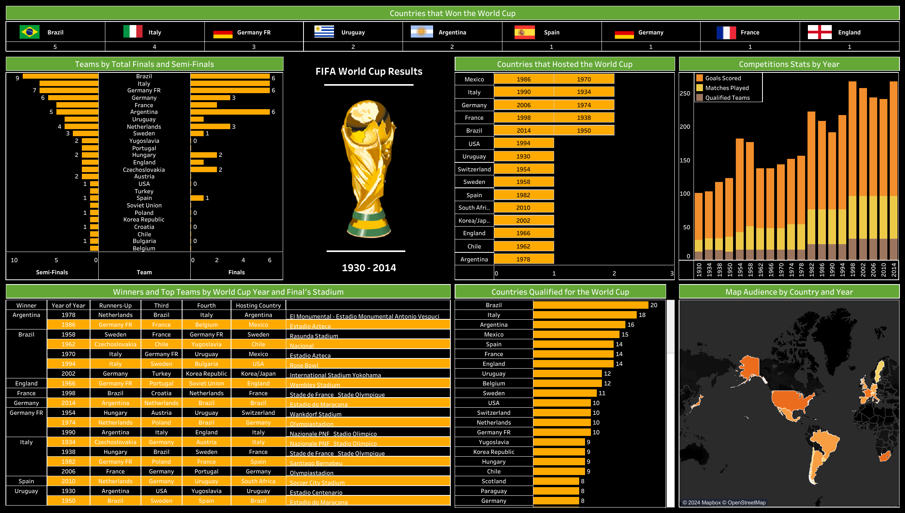

# FIFA World Cup — Exploratory Data Analysis (1930–2014)

An interactive **Tableau dashboard** exploring 84 years of FIFA World Cup history — from the inaugural 1930 tournament in Uruguay to the 2014 edition in Brazil.

---

## Dashboard Preview



---

## Key Insights

| Insight | Detail |
|---|---|
| **Most Titles** | Brazil — 5 World Cup wins |
| **Most Finals Appearances** | Brazil — 6 Finals, 9 Semi-Finals |
| **Most Qualifications** | Brazil — 20 tournaments |
| **Top Host Nation** | Mexico & Italy — Hosted twice each |
| **Peak Goals Scored** | 1954 Switzerland — Highest goals in a single edition |

---

## Repository Structure

```
FIFA World Cup Results 1930-2014/
│
├── FIFA World Cup Results 1930-2014.twbx   # Tableau Packaged Workbook
│
├── dataset/
│   └── world_cup_results.xlsx              # Source dataset (match-level results)
│
├── assets/
│   ├── Dashboard.png                       # Dashboard screenshot
│   ├── World Cup Logo.png                  # FIFA World Cup logo
│   ├── Color Codes.txt                     # Theme color palette
│   └── [Country Flags]                     # Flag images used in the dashboard
│
└── README.md
```

---

## Dashboard Components

The Tableau dashboard includes the following visualizations:

- **Countries that Won the World Cup** — Scoreboard showing all winners with flag icons and title counts
- **Teams by Total Finals & Semi-Finals** — Horizontal bar chart ranking nations by deep tournament runs
- **Countries that Hosted the World Cup** — Table listing every host nation and year
- **Competition Stats by Year** — Stacked bar chart tracking goals scored, matches played, and qualified teams across editions
- **Winners & Top Teams by World Cup Year** — Detailed table with Winner, Runner-Up, Third, Fourth, hosting country, and final stadium
- **Countries Qualified for the World Cup** — Ranked bar chart of total tournament qualifications by country
- **Map Audience by Country and Year** — Geographic heatmap of global World Cup participation

---

## Color Palette

| Color | Hex Code | Usage |
|---|---|---|
| Green | `#64a737` | Primary accent |
| Yellow | `#ffaa00` | Secondary accent |

---

## Tools & Technologies

- **Tableau Desktop** — Dashboard design and data visualization
- **Microsoft Excel** — Source data (`world_cup_results.xlsx`)

---

## Getting Started

1. **Clone the repository**
   ```bash
   git clone https://github.com/shourya2006/FIFA-World-Cup---Exploratory-Data-Analysis.git
   ```
2. **Open the workbook** — Launch `FIFA World Cup Results 1930-2014.twbx` in Tableau Desktop or Tableau Public
3. **Explore** — Interact with filters, hover over charts for tooltips, and discover historical patterns

---

## Dataset

The dataset (`world_cup_results.xlsx`) contains match-level results for every FIFA World Cup tournament from **1930 to 2014**, including:

- Tournament year and host country
- Match results (winners, runners-up, semi-finalists)
- Goals scored and teams qualified per edition

---

## License

This project is intended for educational and analytical purposes. The FIFA World Cup data is publicly available.

---

<p align="center">
  
  <br/>
  <em>Built with Tableau</em>
</p>
